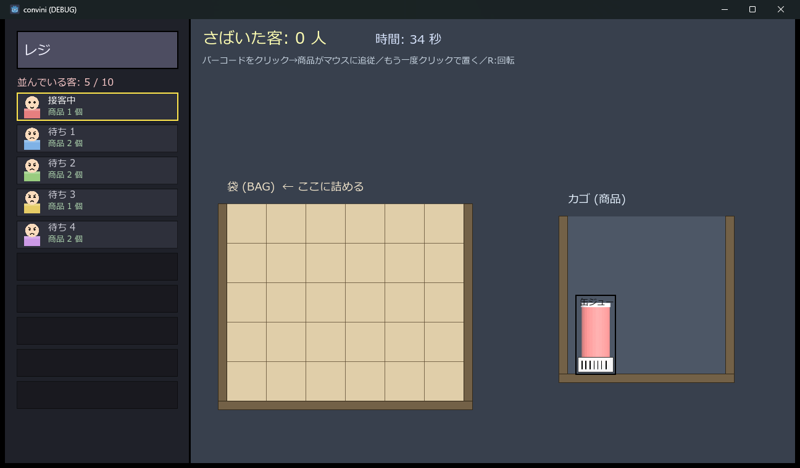

# convini — コンビニ レジ打ちゲーム

Godot 4.6 製の、コンビニのレジ打ち＆袋詰めパズルゲーム。
ゲームコードも3Dモデルも効果音も、**[Claude Code](https://claude.com/claude-code) との対話**で作成しています。



## 遊び方

- 画面左：レジと並んでいる客の列（最大10人）
- 画面右：レジ打ちプレイ画面（袋グリッド＋カゴ）
- **商品のバーコードをクリック**するとスキャンされ、商品がマウスに追従する
- **もう一度クリック**で袋のマスに置く（マス吸着・重なり不可）
- **R キー**で商品を90度回転
- カゴ・袋・商品はすべて当たり判定を持ち干渉する。カゴから出すのも袋に詰めるのも一苦労
- 客の全商品を袋に詰めると次の客へ。**さばいた客の人数がスコア**
- 客が **10人たまると爆発してゲームオーバー**

時間が経つほど商品数が増え、客の出現も速くなる。

## 構成

- `scenes/main.tscn` … 薄い土台（`game_manager.gd` を持つだけ）
- `scripts/game_manager.gd` … ゲーム全体（レイアウト・干渉判定・客/難易度・スコア・演出・効果音）
- `scripts/product.gd` … 商品1個（描画・回転・バーコード）
- `sprites/` … 商品スプライト（Blenderでローポリを作成し真上から正射影でレンダリングした透過PNG）
- `sounds/` … BGM
- `ai_tools/cap.ps1` … 実行中ウィンドウをキャプチャする目視ループ用スクリプト

効果音はファイルを使わず、コードでPCM波形を合成して鳴らしている（スキャン/設置/エラー/客クリア/ゲームオーバー）。

## 開発

エディタで開くか、新規アセット追加後にインポートだけ生成したい場合は Godot 4.6 で:

```
godot --headless --path . --import
```

（`godot` は各自の環境の Godot 4.6 実行ファイルに置き換え）

## クレジット

- **BGM**: 「Caribbean Passion」 by MFP【Marron Fields Production】さん — [DOVA-SYNDROME](https://dova-s.jp/bgm/detail/23461)
- **商品3Dモデル**: Blender で作成（Blender MCP 経由でローポリを生成し、真上から正射影でPNG化）
- **効果音**: コードによるPCM波形合成（音声ファイル不使用）
- **開発**: [Claude Code](https://claude.com/claude-code)（Anthropic）との対話による
